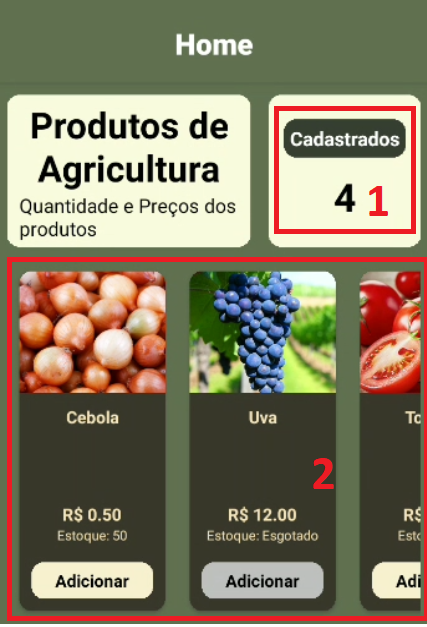
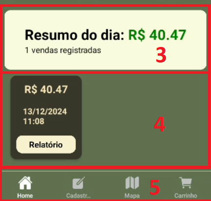
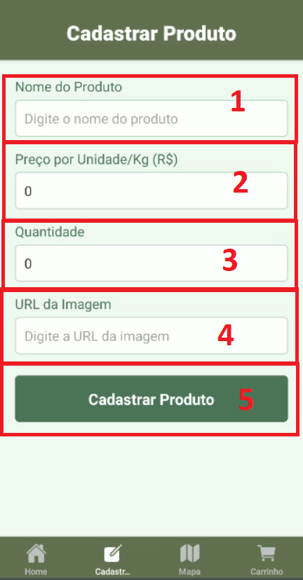
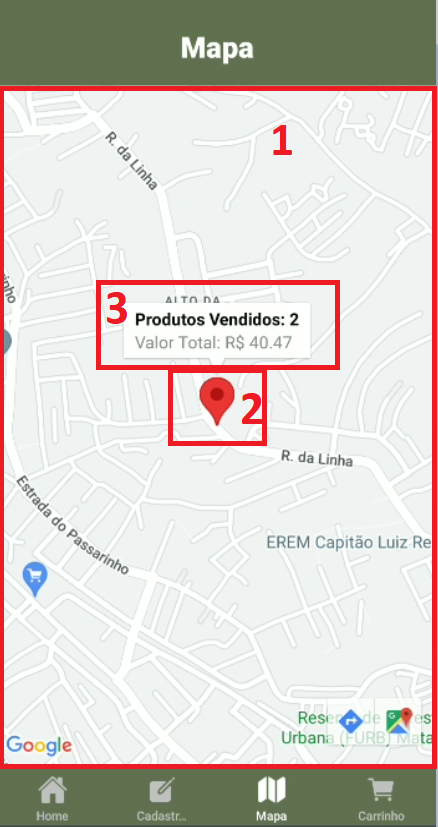
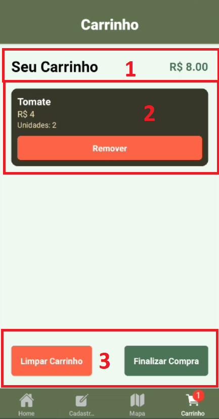

## Documentação da Tela Home

A tela **Home** é a interface principal do aplicativo, onde o feirante pode visualizar informações importantes sobre os produtos cadastrados e as vendas realizadas no dia. Segue a explicação detalhada das seções da tela com base nos elementos destacados nas imagens:

---

### 1. **Produtos Cadastrados (Quantidade Total)**

- Exibe a **quantidade total de produtos cadastrados** no aplicativo.
- Essa informação permite ao feirante saber rapidamente quantos produtos estão registrados para venda.

#### Uso:

- **Visualização rápida** da quantidade total de produtos cadastrados.
- Para adicionar novos produtos, use a aba **Cadastrar Produto** na barra de navegação inferior.

---

### 2. **Carrossel de Produtos**

- Mostra os produtos cadastrados em forma de cartões com as seguintes informações:
  - **Nome do produto** (e.g., Cebola, Uva).
  - **Preço por unidade** (e.g., R$ 0,50).
  - **Estoque disponível** ou se está **esgotado**.
  - Botão **Adicionar**, para enviar o produto ao carrinho de compras.

#### Uso:

- Role horizontalmente para visualizar todos os produtos cadastrados.
- Clique em **Adicionar** para enviar o produto ao carrinho.
  - O botão ficará desabilitado caso o produto esteja esgotado.

---

### 3. **Resumo do Dia**

- Exibe o **valor total das vendas do dia** e o número de **vendas registradas**.
- Ajuda o feirante a acompanhar o desempenho financeiro diário.

#### Uso:

- Visualize rapidamente o total de vendas e o número de transações.
- Para mais detalhes sobre vendas, consulte a seção **Relatórios**.

---

### 4. **Relatórios de Vendas**

- Exibe um cartão para cada venda realizada no dia com:
  - **Valor total da venda** (e.g., R$ 40,47).
  - **Data e horário da venda**.
  - Botão **Relatório**, que mostra os detalhes completos da venda, incluindo os produtos vendidos.

#### Uso:

- Clique em **Relatório** para visualizar informações detalhadas da venda, como:
  - Produtos vendidos.
  - Quantidade de cada produto.
  - Valor pago por cada produto.

---

### 5. **Barra de Navegação Inferior**

- **Home:** Retorna à tela principal.
- **Cadastrar Produto:** Permite adicionar novos produtos ao sistema.
- **Mapa:** Mostra as localizações onde as vendas foram realizadas.
- **Carrinho:** Exibe os produtos adicionados ao carrinho para finalizar a compra.

#### Uso:

- Utilize a barra para navegar entre as telas principais do aplicativo.
- Acesse rapidamente a funcionalidade desejada.

---

**Nota:** A tela foi projetada para ser intuitiva e fácil de usar, mesmo para usuários com pouca familiaridade com tecnologia.

---

## Documentação da Tela Cadastrar Produto

A tela **Cadastrar Produto** permite ao feirante adicionar novos produtos ao sistema de forma rápida e simples. Cada campo é usado para registrar informações importantes sobre o produto, garantindo que ele esteja disponível para venda.

---

### 1. **Nome do Produto**

- **Campo:** Texto
- **Descrição:** O nome do produto que será exibido nas telas de vendas e no carrinho.
- **Exemplo:** "Tomate", "Batata", "Uva".

#### Uso:

1. Clique no campo **"Nome do Produto"**.
2. Digite o nome desejado.
3. Certifique-se de usar um nome claro e sem erros ortográficos.

---

### 2. **Preço por Unidade/Kg (R$)**

- **Campo:** Numérico (aceita valores decimais).
- **Descrição:** Insira o preço do produto por unidade ou por quilograma (Kg).
- **Exemplo:** "2.50", "10.00".

#### Uso:

1. Clique no campo **"Preço por Unidade/Kg (R$)"**.
2. Digite o valor do preço usando ponto (.) para separar decimais.
3. Caso o preço seja por quilograma, use o valor padrão de mercado.

---

### 3. **Quantidade**

- **Campo:** Numérico (apenas inteiros).
- **Descrição:** Insira a quantidade total disponível em estoque.
- **Exemplo:** "50", "100".

#### Uso:

1. Clique no campo **"Quantidade"**.
2. Digite a quantidade disponível do produto no estoque.
3. Caso o estoque seja ilimitado, utilize um número representativo.

---

### 4. **URL da Imagem**

- **Campo:** Texto.
- **Descrição:** Link (URL) da imagem que será exibida como visual do produto.
- **Exemplo:** `https://exemplo.com/imagem-tomate.png`.

#### Uso:

1. Clique no campo **"URL da Imagem"**.
2. Cole o link da imagem desejada ou digite manualmente.
3. Certifique-se de que a URL aponta para uma imagem válida.

---

### 5. **Botão Cadastrar Produto**

- **Ação:** Salvar o produto no sistema.
- **Descrição:** Quando preenchidos corretamente todos os campos acima, clique neste botão para adicionar o produto.

#### Uso:

1. Após preencher todos os campos, clique no botão **"Cadastrar Produto"**.
2. O produto será salvo no sistema e estará disponível para visualização e venda.

---

**Nota:** A tela possui validação para os campos. Caso algum campo não esteja preenchido corretamente, o sistema exibirá uma mensagem de erro.

---

## Documentação da Tela Mapa

A tela **Mapa** permite ao feirante visualizar geograficamente as vendas realizadas, exibindo a localização exata de cada transação no mapa. É uma ferramenta útil para análise de distribuição de vendas e planejamento logístico.

---

### 1. **Mapa**

- **Descrição:** A área principal exibe o mapa com as marcações correspondentes às vendas realizadas.
- **Funcionalidade:** Mostra o local exato da venda utilizando as coordenadas GPS (latitude e longitude) registradas durante a transação.

---

### 2. **Marcador (Pin Vermelho)**

- **Descrição:** Representa uma venda realizada. Cada marcador é posicionado no local exato onde a venda foi registrada.
- **Interatividade:**
  - O feirante pode clicar no marcador para obter mais informações sobre a venda (ver item 3).

---

### 3. **Informações da Venda**

- **Descrição:** Ao clicar em um marcador, um balão informativo aparece com detalhes sobre a venda.
- **Conteúdo:**
  - **Produtos Vendidos:** Quantidade total de produtos incluídos na venda.
  - **Valor Total:** Valor financeiro total da venda.
- **Uso:** Clique no balão para ser direcionado à tela de **Detalhes da Venda**, onde informações mais completas estarão disponíveis.

---

### Fluxo de Navegação

1. **Visualizar Vendas no Mapa:**
   - Acesse a aba **Mapa** para carregar as informações das vendas realizadas.
2. **Interagir com um Marcador:**
   - Clique em um marcador para visualizar detalhes básicos.
3. **Acessar Detalhes da Venda:**
   - Clique no balão de informações para ser redirecionado à tela completa de detalhes.

---

**Nota:** Certifique-se de que o GPS do dispositivo está habilitado para registrar corretamente as vendas no mapa.

## Documentação da Tela Carrinho

A tela **Carrinho** permite ao feirante gerenciar os produtos que deseja vender ou analisar antes de concluir a transação. É uma ferramenta essencial para revisar itens, ajustar quantidades ou finalizar a compra.

---

### 1. **Título e Valor Total**

- **Descrição:** Exibe o título "Seu Carrinho" e o valor total calculado dos itens no carrinho.
- **Funcionalidade:**
  - O valor total é calculado automaticamente com base no preço e na quantidade dos produtos adicionados.
  - É atualizado em tempo real ao remover itens ou limpar o carrinho.

---

### 2. **Lista de Produtos**

- **Descrição:** Cada produto no carrinho é exibido em forma de cartão com os seguintes detalhes:
  - **Nome do Produto:** Nome do item adicionado ao carrinho.
  - **Preço por Unidade:** Valor unitário do produto.
  - **Unidades:** Quantidade de unidades do produto no carrinho.
  - **Botão "Remover":** Permite excluir o produto do carrinho.
- **Interatividade:**
  - Clique em **Remover** para excluir o produto selecionado do carrinho. O estoque será automaticamente incrementado no sistema.

---

### 3. **Botões de Ação**

- **Limpar Carrinho:**
  - **Descrição:** Remove todos os itens do carrinho e atualiza o estoque.
  - **Uso:** Clique para esvaziar o carrinho completamente. Útil caso o feirante deseje reiniciar a venda.
- **Finalizar Compra:**
  - **Descrição:** Conclui a transação e registra a venda no sistema.
  - **Uso:**
    - Clique para abrir o processo de finalização da venda.
    - O sistema requisitará a localização GPS do dispositivo para registrar a venda no mapa.
    - Após a confirmação, o carrinho será limpo, e os dados da venda serão atualizados no aplicativo.

---

### Fluxo de Navegação

1. **Adicionar Produtos:**
   - Acesse o **Home** e clique em **Adicionar** nos produtos desejados.
2. **Gerenciar Carrinho:**
   - Revise os itens no carrinho, ajustando conforme necessário.
3. **Finalizar Compra:**
   - Clique em **Finalizar Compra** para concluir a transação.
4. **Limpar Carrinho (Opcional):**
   - Clique em **Limpar Carrinho** para reiniciar a seleção de produtos.

---

**Nota:** Certifique-se de que o dispositivo está conectado à internet e com a localização habilitada ao finalizar a compra.
